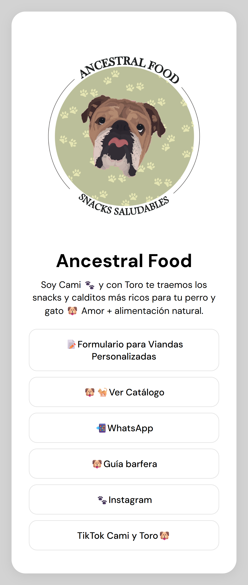

# 🐾 Ancestral Food - Portal de Enlaces

### 📋 Descripción del Proyecto
Este portal centraliza el ecosistema digital de **Ancestral Food**, un emprendimiento de alimentación natural para perros y gatos. La solución surge de la necesidad de facilitarle a los clientes el acceso a catálogos, formularios de viandas y canales de contacto desde un único punto de entrada.

### 🚀 Demo en Vivo
Podes ver el proyecto funcionando acá: [https://portalancestral.netlify.app/](https://portalancestral.netlify.app/)

### ✨ Características Principales
* **Diseño Responsive:** Optimizado para dispositivos móviles, priorizando la usabilidad "on-the-go".
* **Interfaz Limpia y Minimalista:** Enfocada en la Identidad Visual de la marca.
* **Scroll Interactivo:** Implementación de efectos visuales dinámicos (blur y opacidad) en el encabezado mediante JavaScript para mejorar la experiencia de usuario (UX).

### 🛠️ Stack Tecnológico
* **HTML5:** Estructura semántica.
* **CSS:** Flexbox para el layout y Media Queries para adaptabilidad.
* **JavaScript:** Lógica para la manipulación del DOM basada en eventos de scroll.

### 📐 Perspectiva de Análisis Funcional
Desde el rol de Analista, este proyecto resuelve el **pain point** de la fragmentación de información. Se priorizaron los enlaces de mayor conversión (Formulario de Viandas y Catálogo) en la parte superior del flujo visual.

### 🧠 Decisiones de Diseño
- Se priorizó un diseño **mobile-first**, ya que la mayoría de los usuarios acceden desde Instagram.
- Se redujo la profundidad de navegación para minimizar fricción en el flujo de conversión.
- Se implementó un **efecto de blur dinámico en el hero** para mantener foco visual en los enlaces principales.

## 🖼️ Vista del Proyecto

## 👨‍💻 Autor

Desarrollado por **Federico Rolla**

